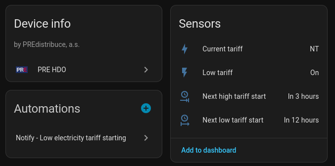

# PRE Distribuce HDO

[](https://hacs.xyz)
[](LICENSE)

Home Assistant integration for tracking HDO (low/high electricity tariff) schedules from [PRE Distribuce](https://www.predistribuce.cz) (Czech Republic).

Inspired by [HomeAssistant-PREdistribuce](https://github.com/slesinger/HomeAssistant-PREdistribuce) by [slesinger](https://github.com/slesinger)



## Features

- **Binary sensor** - current tariff state (low/high)
- **Sensors** - current tariff name, next low/high tariff start timestamps
- **Multi-day schedules** - fetches and processes multiple days of HDO data
- **Config flow** - UI-based setup, no YAML needed
- **Async** - non-blocking API calls via aiohttp
- **No dependencies** - pure regex parsing, no lxml or other C libraries

## Installation

### HACS (recommended)

1. Add this repository as a custom repository in HACS
2. Install "PRE Distribuce HDO"
3. Restart Home Assistant
4. Go to **Settings > Devices & Services > Add Integration > PRE Distribuce HDO**
5. Enter your receiver command ID

### Manual

Copy `custom_components/pre_hdo/` to your Home Assistant `config/custom_components/` directory.

## Configuration

The integration is configured through the UI. You need your **HDO receiver command ID** - find it on the yellow/white sticker on your HDO receiver or electricity meter.

## Entities

| Entity | Type | Description |
|--------|------|-------------|
| Low tariff | Binary sensor | ON when low tariff (NT) is active |
| Current tariff | Sensor | "NT" (low) or "VT" (high) |
| Next low tariff start | Sensor | Timestamp of next low tariff period |
| Next high tariff start | Sensor | Timestamp of next high tariff period |

## Development

```bash
uv sync
uv run pytest
```
